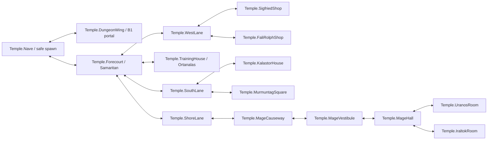

# Hub — church and essential service district

Candidate for W3-01: map `L_LighthavenTempleDistrict`, area `Area.LighthavenTempleDistrict`. Read [shared conventions](README.md) first. **All U coordinates, room sizes, widths, elevations, NPC transforms and lighting positions below are P prototype proposals (V-01, 2026-10-07), not measured original tiles.** 1 U = 100 cm; +X projects image down-right, +Y image up-right. Local origin is the church's front/−Y, −X floor corner; all main floors Z=0. Player ruler 175 cm; common route minima 2.4 U doors ×3 U headroom, 3.2 U corridors, 3 U stairs. This safe hub has no resident monster or Balork transit requirement.

Evidence opened: `P/assets/references/maps/LighthavenClassic.png` (M5, 2705×1848) and `P/assets/concepts/temple-and-basement-concept.png` (C-env, 1983×793), at original detail; P is the package root in README. M5 establishes relative source positions, not this metric reconstruction. Approximate pixel anchors below refer to the original full image with top-left origin. No image was copied or altered.

## Playable extent and source correspondence

The church is toward the upper-right of the built-up town. Sigfried is above-left, Fali/Rolph left/below-left, Jagar Kar/Ortanalas below-left, Kalastor and Murmuntag farther down-left, and the mage building separately across water above-right (V). Preserve that ordering; distances and lane widths are deliberately stretched to fit clear service approaches (P). Iraltok and Uranos remain at the mage building, never the church.

The Stage 1 playable district is the **union** of the room rectangles, forecourt/service square, listed street strips and sand-route strips below (P). Terrain outside this union is scenic and non-navigable. Use low walls, fences, hedge masses and shoreline edging to explain boundaries; collision caps meet the strip edges without shrinking clear widths. A broad support mesh may exist beneath town rectangles, but do not bake its entire surface as walkable. Town construction envelope is `X[−34,28], Y[−74,32]`; the mage-route envelope extends to `X[−50,28], Y[28,86]`. These envelopes are limits, not additional walking surfaces.

Full city, fields, other interiors, western river bridges, Crypt, Lighthaven Cave, Lothar's Temple and Stonehenge are scenic/out of bounds. M5 labels Crypt and Cave separately from the church Dungeon (V). None receives a portal. At the mage approach's outer-island/Stonehenge fork, close the unbuilt branches with a modest visible rope/marker boundary (P); do not imply the source lacked them. No invisible water shortcut or new direct bridge is part of this candidate.

This is a proposed walkable graph, not a graph extracted from original-client pathfinding. All service links are continuous ground in this area; only the dungeon link travels to another map.

## Rooms, exterior pads and thresholds

Bounds are clear floor inside walls, in U. Doors remain open apertures for the graybox. Every door below is 3.2 U wide ×3 U high unless stated. Walls 0.2 U thick outward, full collision 4 U high; rooms have cutaway/faded presentation for the elevated camera (P). At an aperture center `(x,y)` on an X-constant wall, cut Y±1.6; on a Y-constant wall, cut X±1.6. All listed floors/thresholds are Z=0 except the dungeon ramp.

| Candidate region ID | Clear bounds / size | Connections and exact aperture centers | Evidence |
|---|---|---|---|
| `Temple.Nave` | X[0,16], Y[0,24]; 16×24 U | Forecourt at `(8,0)` on −Y wall; DungeonWing at `(0,5)` on −X wall; no other exits | V: gray floor, red aisle, benches, church names near source `(1900,872)`; I: entry at lower-left carpet end; P: metrics/cuts |
| `Temple.DungeonWing` | X[−12,−0.2], Y[0,10]; 11.8×10 U | Nave via the 0.2 U threshold `(−0.2,5) → (0,5)`; stair on −X side; no outdoor side entrance | V: `Dungeon` wing near source `(1716,869)`; I: annex access; P: plan and stair |
| `Temple.Forecourt` | X[−6,20], Y[−12,−0.2]; 26×11.8 U open pad | Nave via `(8,−0.2) → (8,0)`; WestLane at `(−4,−8)`; TrainingLane `(12,−12)`; SouthLane `(−2,−12)`; ShoreLane `(20,−6)` | V: open ground by Samaritan `(1706,927)`; P: limits/route junctions |
| `Temple.SigfriedShop` | X[−30,−14], Y[8,24]; 16×16 U | WestLane door `(−22,8)` on −Y wall | V: distinct brown-walled shop above-left of church, source `(1702,783)`; P: footprint/door |
| `Temple.FaliRolphShop` | X[−22,−6], Y[−24,−12]; 16×12 U | FaliSpur door `(−14,−12)` on +Y wall; shared unobstructed service interior | V: shared name/building `(1536,916)`; P: footprint/door/counter layout |
| `Temple.TrainingHouse` | X[4,20], Y[−34,−22]; 16×12 U | TrainingLane door `(12,−22)` on +Y wall | V: Jagar Kar/Ortanalas building `(1650,1009)`; P: simplified shared room, not an asserted original internal room allocation |
| `Temple.KalastorHouse` | X[4,20], Y[−64,−52]; 16×12 U | KalastorSpur door `(12,−52)` on +Y wall | V: named building `(1362,1174)` farther down-left; P: footprint/door |
| `Temple.MurmuntagSquare` | X[−22,−6], Y[−70,−54]; 16×16 U open pad | MurmuntagSpur enters `(−14,−54)`; no invented trainer building | V: Murmuntag label in open ground `(1076,1158)`; P: pad/standing point |
| `Temple.MageApron` | X[−40,−16], Y[54,59.8]; 24×5.8 U | Causeway endpoint `(−33,56)`; vestibule door `(−33,60)` via clear path | V/I: inner sand beside building; P: widening and entry choice |
| `Temple.MageVestibule` | X[−48,−16], Y[60,66]; 32×6 U | Apron `(−33,60)` on −Y; MageHall across `(−33,66) → (−33,66.2)` on +Y, both 3.2 U | V: separate multiroom mage building around source `(2140,460)`; P: vestibule/threshold |
| `Temple.MageHall` | X[−36,−30], Y[66.2,84.2]; 6×18 U | Vestibule `(−33,66.2)`; Uranos `(−36,72)`; Iraltok `(−30,77)` | V: source partitions; I: internal access; P: clear hall and openings |
| `Temple.UranosRoom` | X[−48,−36.2], Y[66.2,78]; 11.8×11.8 U | MageHall via +X threshold `(−36.2,72) → (−36,72)` | V: Uranos lower-left part of mage building, source `(2053,482)`; P: room rectangle/door |
| `Temple.IraltokRoom` | X[−29.8,−16], Y[70.2,84.2]; 13.8×14 U | MageHall via −X threshold `(−29.8,77) → (−30,77)` | V: Iraltok right-side label `(2245,453)`; P: room rectangle/door |

The unused mage rectangles `X[−48,−36.2],Y[78.2,84.2]` and `X[−29.8,−16],Y[66.2,70]` are scenic partitioned spaces, closed to navigation (P). A Lothan name marker may occupy the latter, matching his source lower/right label, but supplies no invented service. Required teachers have the two explicit accessible rooms above. A chest label does not require a loot actor.

Shared partition faces are explicitly separated by 0.2 U: wing/nave X=−0.2…0, forecourt/nave Y=−0.2…0, mage apron/vestibule Y=59.8…60, vestibule/upper mage rooms Y=66…66.2, Uranos/hall X=−36.2…−36 and hall/right rooms X=−30…−29.8. Build one wall within each strip and carry flat Z=0 floor through its listed aperture; do not double walls or consume the stated clear dimensions. The small offsets account for collision, not recovered source measurements.

## Streets and mage causeway

Build each polyline as a **4 U clear strip**, with 4×4 U clear pads at bends, flat Z=0. Trim no listed strip before its room/pad connection; doorway narrowing to 3.2 U is centered at the specified threshold. A route ending on a wall meets the wall aperture, not a closed wall. Street crossings are intentional only at listed shared junctions. Sources show ground/streets (V), their traversal is I, all centerlines/widths P.

| Candidate route ID | Centerline in U, ordered from church outward | Connects / source correspondence |
|---|---|---|
| `Temple.WestLane` | `(−4,−8) → (−26,−8) → (−26,4) → (−22,4) → (−22,8)` | Forecourt to Sigfried; skirts −X side of dungeon wing, never cuts through it |
| `Temple.FaliSpur` | `(−14,−8) → (−14,−12)` | WestLane to Fali/Rolph door |
| `Temple.TrainingLane` | `(12,−12) → (12,−22)` | Forecourt to source-adjacent training house |
| `Temple.SouthLane` | `(−2,−12) → (−2,−48)` | Forecourt down the gap between shops/training blocks; turn junction at `(−2,−44)` |
| `Temple.KalastorSpur` | `(−2,−48) → (12,−48) → (12,−52)` | SouthLane to Kalastor; passes above rather than through the building |
| `Temple.MurmuntagSpur` | `(−2,−44) → (−14,−44) → (−14,−54)` | SouthLane to open training square, separate from Kalastor's house |
| `Temple.ShoreLane` | `(20,−6) → (24,−6) → (24,28)` | Forecourt past +X side of nave to town shore; no passage through the altar |
| `Temple.MageCauseway` | `(24,28) → (24,36) → (16,42) → (0,42) → (−16,50) → (−30,50) → (−33,56)` | ShoreLane to MageApron; preserve long winding approach rather than span nearest water gap |
| `Temple.MageDoorApproach` | `(−33,56) → (−33,60)` | Apron to mage vestibule door |

MageCauseway diagonals are straight segments with the same perpendicular 4 U clear width and unobstructed 4×4 U turn pads; chamfer outside edges as needed without narrowing. Low edge collision follows the walking strip. Sand can visually extend beyond collision, but cannot suggest a traversable unfinished branch. Water plane Z=−0.5 U is scenic with blocked entry, not a lethal hazard or alternate path (P). Banks/edging use ≤1 U visible height away from interaction sightlines (P).

| M5 source segment | Graybox correspondence | Confidence / remaining uncertainty |
|---|---|---|
| Town shore `(2275,784)` → east bend `(2406,719)` | `(24,28)` → `(24,36)` | V: pale sand; I: continuous route; P: turn/width |
| Bend back left along `(2212,669)` and `(2050,654)` | `(24,36)` → `(16,42)` → `(0,42)` | V: winding strip over blue water; P: simplified shape |
| Branching sand near `(1888,617)` | `(0,42)` → `(−16,50)` → `(−30,50)` | V: inner/outer fork; I: take inner branch; P: junction placement |
| Inner shore `(1966,573)` toward building lower edge `(2111,579)` | `(−30,50)` → `(−33,56)` and MageApron | V/I: floor-looking sand meets building surroundings; P: vestibule door, final route |
| Outer sand arm via `(1787,466)`, `(1898,347)`; Stonehenge continuation near `(2068,329)` | Scenic only beyond inner fork | V: additional branches; P: Stage 1 boundary closure |

The map depicts a sand connection, not a labelled bridge/teleporter. Its original-client passability and final threshold remain unverified. This candidate assumes a walkable widened sandbank; record a future correction if navigation/source review disproves that interpretation.

## Church detail and first descent

Nave clear red aisle: `X[6,10],Y[0,21]`; reserve cross-aisles `Y[8,10]`, `Y[12,15]`, `Y[17,21]` across the room (P dimensions, V red-aisle/pew motif). Four pew blocks: `X[1,4]` or `X[12,15]` crossed with `Y[10,12]` or `Y[15,17]`, ≤1 U tall (P). A modest altar plinth occupies `X[6,10],Y[22,23]`, Z=0.2 U, with a table-like proxy ≤1.2 U above floor (I: altar reading; P: exact fixture). The arrival box and aisle remain flat and empty. Decorative thresholds have no collision lip.

Exterior: use a single modest 4 U eave/6 U ridge mass over the nave, plus a lower wing roof, all P. Roof footprint follows these room blocks; omit tall cathedral towers. C-env supports earthy masonry, dark timber and slate-like roof mood, not those elevations or its central roof opening. Hide/cut away this roof above occupied interiors; keep source red carpet legible from the elevated camera. Church floor and surrounding ground are flush for this first graybox; steps in the concept are not mandatory geometry.

DungeonWing ramp: 3 U clear across `Y[3.5,6.5]`, runs from top `(−8,5,0)` toward end `(−12,5,−1)`, a P 1:4 grade (about 14°). Cut out the flat floor in `X[−12,−8],Y[3.5,6.5]`; put smooth collision beneath decorative treads and provide ≥3 U headroom above the ramp. −X end is a travel terminus, not a hole to walk into. The arrival remains on the flat wing floor. No inferred physical stair vector is claimed from the M5 `Dungeon` label.

| Candidate entrance / purpose | Arrival transform and facing | Departure trigger / side | Paired destination / safety |
|---|---|---|---|
| `Area.LighthavenTempleDistrict::Temple.SafeSpawn` | `(8,5,0)`, +Y / yaw90°, floor pivot | None; creation/recovery only | No portal pair. Clear `X[5,11],Y[2,8]`, Z0 arrival floor; no pews/NPCs/counters |
| `Area.LighthavenTempleDistrict::Temple.Descent` | `(−4,5,0)`, +X / yaw0°, facing nave doorway | On wing −X side at `(−10,5,−0.5)` on ramp; interaction footprint 3 U across Y ×1 U along X | Pair `Area.TempleB1::Entry`, which returns here. Clear arrival `X[−7,−1],Y[2,8]` at Z0; trigger and arrival do not overlap |

Coordinates name ground/foot positions, not capsule centers; W3-04 must apply the actor's actual capsule offset and validate placement. The whole hub is a safe area by authored policy (P); no encounter anchors, hostile patrols or attack sources are placed. Preserve both arrival boxes as collision-free, and use explicit travel interaction/rearm from README. Exiting B1 returns to the wing; creation/recovery uses the nave. Do not turn these into duplicate one-way portals.

## Named service anchor candidates

All listed standing positions and facing directions are P. M5 supports each building/region (V), not the text-center-as-feet interpretation. NPC aliases below remain human design IDs; W3-04 assigns persistent entity GUIDs. Reserve an empty 3×3 U player interaction pad centered at each **approach** point, with a clear path from the relevant door. The actual interaction range, prices, prerequisites and transactions are not specified by this geometry.

| Candidate actor alias | Region; NPC `(x,y)`; facing | Player approach `(x,y)` | Ledger service / evidence |
|---|---|---|---|
| `NPC.BrotherKiran` | Nave `(3,21)`; −Y | `(3,19)` | Priest/temple presence from world ledger; no new service invented |
| `NPC.Kilhiam` | Nave `(3,14)`; +X | `(6,14)` | Light teacher; source church name `(1864,855)` |
| `NPC.Moonrock` | Nave `(13,20)`; −X | `(10,20)` | Heal Light teacher; source church name `(1868,882)` |
| `NPC.Samaritan` | Forecourt `(−2,−3)`; −Y | `(−2,−6)` | Rat-errand service outside dungeon side; source `(1706,927)` |
| `NPC.Sigfried` | SigfriedShop `(−25,18)`; +X | `(−22,18)` | Ashwood Flatbow / Wooden Arrows vendor at source shop |
| `NPC.Fali` | FaliRolphShop `(−18,−19)`; +X | `(−15,−19)` | Potion of Mana seller; not substituted with Yolak |
| `NPC.Rolph` | FaliRolphShop `(−9,−19)`; −X | `(−12,−19)` | Armour merchant; unresolved upgrade stock stays unresolved |
| `NPC.Ortanalas` | TrainingHouse `(15,−29)`; −X | `(12,−29)` | Attack/Archery per rules ledger; source `(1651,1025)` |
| `NPC.JagarKar` | TrainingHouse `(7,−29)`; +Y | `(7,−26)` | Co-located source label; no unverified offer assigned |
| `NPC.Kalastor` | KalastorHouse `(15,−59)`; −X | `(12,−59)` | Dodge/Archery; distinct route required even with Ortanalas present |
| `NPC.Murmuntag` | MurmuntagSquare `(−17,−62)`; +X | `(−14,−62)` | Attack; outside, not moved into TrainingHouse |
| `NPC.Uranos` | UranosRoom `(−43,72)`; +X | `(−40,72)` | Stone Shard and bat-wing turn-in at mage building |
| `NPC.Iraltok` | IraltokRoom `(−22,77)`; −X | `(−25,77)` | Fire Dart at mage building |

NPCs stand outside walking/arrival strips, not in doors. Keep desks/counters outside the approach pads. Brother Kiran's pad abuts but does not intersect the nearest pew; preserve its full 3×3 U. Kilhiam's pad fits the cross-aisle. Make the service sign/target visible without a camera orbit. All services still need real W4-07 offers, proximity interactions and affordable progression; geometry and names alone do not meet that acceptance.

**Encounter candidates:** none. The floor matrix assigns hostiles to B1–B4 only. Use no creature, quest reward, rat-kill or loot spawn in this hub spec. Nevanis/Shovanis remain in [B1](b1.md), not replacement town healers.

## Landmarks, light and camera cues

| Element / candidate location | Reading from elevated camera | Confidence |
|---|---|---|
| Red aisle and altar end `(8,22)` | Straight visual line from SafeSpawn to temple teachers; gray floor contrasts with red | V motif / P material sizing; no magical portal effect |
| Dungeon lintel/amber lamp at `(−0.5,5,2.5)` | Distinguish left-wing descent from exterior door | V wing / P lamp and sign; keep clear of approach view |
| Samaritan beside wing-side forecourt | Quest return visible after church exit without relocating inside | V relative position / P anchor and restrained marker |
| Wood/plaster silhouettes at shops | Distinct shop fronts remain visible along route; roof cutaway on entry | V broad materials/building group / P massing and fade behavior |
| Small warm doorway lamps at each service threshold, Z2.5 U | Repeat a readable destination cue along safe routes | P light positions; brightness unset, no inferred historical fixtures |
| Pale winding sand / blue water | Mage destination stays visibly separate across water; turn pads read as sand, not teleport platforms | V palette/winding strip / P collision width and edge markers |
| Mage partitions and two teacher rooms | Distinct Uranos and Iraltok endpoints; floor/label visibility through cutaway | V multiroom building/names / P internal paths |

Use ambient daylight to keep services readable; C-env sunset/torch pools are a mood option, not a mandatory dark hub. Cutaway walls must preserve targeting against actual collision. Test nave door, wing bend, shop pads and every sand turn at the shared camera extremes. No lighting intensity, exposure or target readability result has been measured.

## Answers to world-ledger visual checkpoints

| World-ledger row | Answer from this inspection | Confidence / unresolved remainder |
|---|---|---|
| Church upper-right; nave/pews/red carpet/altar; dungeon left wing; Samaritan | Church is upper-right of built-up town; gray nave, red aisle and benches visible; Dungeon label is on image-left wing, Samaritan outside below-left | V for labels/visible furniture; I for exact altar identity/entry threshold; P elevations/plan |
| Church left wing ↔ B1.Entry | M5 labels Dungeon at the wing; paired destination follows selected four-floor sequence and B1 evidence | V wing label; I floor pairing; P local anchor/facing; no historical trigger semantics |
| Samaritan exact forecourt side/interaction anchor | Outside near dungeon side, not nave interior | V relative side; P exact standing/approach points |
| Mage tower route | Pale continuous-looking winding sand runs from town neck around to mage building surroundings; inner and outer branches visible | V sand shape; I traversability/inner approach; P widening/final door; original client still untested |
| Trainer building and reachable street route | Jagar Kar/Ortanalas share below-left building; Kalastor is farther below-left; Murmuntag stands in open ground farther left | V names/regions; I street continuity; P apertures/paths. Individual trainer functions remain text evidence |
| Sigfried precise shop anchor | Distinct building above-left of church near shoreline | V building; P interior standing point |
| Fali/Rolph building anchor | Shared labelled building left/below-left of church, above-left of training house | V building; P exact merchant allocation/counters |
| World scale, exact door widths/transforms | Cannot recover centimeters or original tile origin from M5 | Missing historical values; P complete candidate grid/clearances supplied here |

## W3 review checklist and remaining uncertainty

Walk SafeSpawn→all thirteen named anchors→wing→B1→wing and all required service routes in both directions, without teleporting a trainer or debug teaching. Test door/frame clearance, pad targeting and controller focus; demonstrate actual purchases/training later with W4 data. Validate sand-edge collision and both camera orbit extremes, and compare a matching elevated-camera overlay with M5 before art lock. The closed scenic branches must be visibly explained without obscuring the required inner mage route.

No Unreal map was authored, no build/editor/cook/package/navigation/play test ran, and source-client passability is not verified. Actual engine/project maps, collision/navmesh, player/controller/camera and W3/W4 interaction/travel systems are prerequisites. The mage doorway, shop door cuts, metric compression and roof heights are intentional prototype assumptions awaiting that review, not recovered original geometry.
