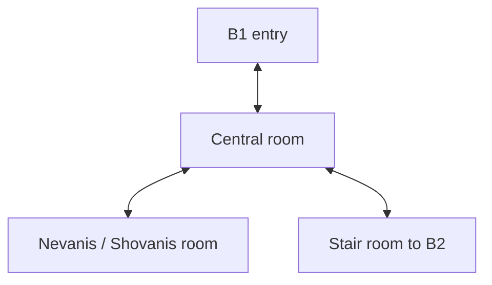

# Lighthaven temple district and basement encounters

## 1. World baseline

Use the five downloaded maps in `assets/references/maps/`, explained in [Lighthaven evidence](../research/lighthaven-evidence.md). They are accessible host reference maps, with exact historical patch unspecified. Preserve their core layout, but keep source facts separate from the practical reconstruction choices below.

The main temple, its four-floor dungeon, the cemetery tomb/crypt and Lighthaven Cave are different locations. Stage 1 builds the temple dungeon. Neither the name “catacombs” nor a cemetery image authorizes substituting a generic undead dungeon.

Canonical level assets:

| Asset | Playable purpose | Scope |
|---|---|---|
| `L_Frontend` | Character creation/selection and settings | Stage 1A |
| `L_LighthavenTempleDistrict` | Church, forecourt, safe spawn, essential service routes | Church polished in Stage 1; peripheral services may remain simple until Stage 2 |
| `L_TempleB1` | First combats, healer branch, rat errand | Stage 1A |
| `L_TempleB2` | Broader creature set and spell/loot play | Stage 1B |
| `L_TempleB3` | More complex navigation and stronger enemies | Stage 1B |
| `L_TempleB4` | Final descent and Balork | Stage 1B |

Separate small non-World-Partition maps are sufficient. Portal transitions may fade/load; do not spend the prototype budget on a seamless streaming world. Interiors and service routes in the hub may be sublevels/placed spaces if that simplifies production, but must retain stable area and entrance IDs.

## 2. Hub and service route

The map locates the church toward the image's upper-right town area, with dungeon access on its left-side wing and Samaritan nearby. Use the nave, benches, red-carpet/altar reading and modest building scale as anchors. Roof/exterior elevation details are reconstruction unless supported by additional artwork.

Stage 1A includes the safe arrival inside the church, essential named temple NPCs, doorway, forecourt and basement access. Neighbouring silhouettes establish the location without requiring every shop interior.

Stage 1B adds a walkable, source-grounded route to training and purchase services. This is necessary for a fresh ranged or magic character. Keep NPCs in their documented locations: temple teachers in the temple, town skill trainers in town, and Iraltok/Uranos at the mage tower. Construct the route's actual ground/bridge access after tracing the source; if that map leaves access uncertain, record the temporary route as reconstruction. Do not teleport the teacher to the church or make the player use a developer console.

The first normal shopping/training loop must be affordable through legitimately available rewards. Verify before locking XP/drop tables that a fresh character can acquire its first intended combat spell and a usable weapon. A finite dungeon combined with an unaffordable training price is a progression softlock.

## 3. Map-to-Unreal reconstruction process

1. Preserve original PNG bytes and hash. Make a separate working trace; do not redraw over the supplied source.
2. Identify the two isometric floor axes. Project/traverse floor boundaries into a new orthogonal grid, using visible tile repetition and door openings. Pixels are not centimeters.
3. Assign room IDs, walkable polygons, door apertures and portal pairs. Extract a connectivity graph before adding surface detail.
4. Pick a modular grid and character-relative scale. Proposed starting construction grid: 100 cm, with 200/400 cm wall sections. Make minimum corridor/door width sufficient for the player and intended enemy collision. These values are modern reconstruction choices.
5. Build graybox collision and navigation; test all routes with placeholder characters before decorating.
6. Review an overlay in an equivalent camera orientation. Record differences explicitly: corridor widening, stair replacement, camera cutaway and object simplification.
7. Freeze room/portal IDs before art. Art agents may improve surfaces without changing layout or encounters silently.

For ambiguous doors, use a walk-through reference or additional source if available. Otherwise leave a documented interpretation and a validation task. Do not claim recovered original tile coordinates from this package.

## 4. Floor layouts and encounter purposes

### B1: orientation and recovery

Four visible chambers: `Entry`, `Hub`, `Healers`, `Descent`. This is the strongest directly interpretable topology in the source.

The healer branch must remain reachable without crossing an unavoidable boss encounter. Reserve clear interaction space around both NPCs. The entry is safe from immediate damage while a floor loads. Brown Rats support the beginner errand; other verified B1 species introduce target selection and movement.

Proposed tuning: 12 Brown Rat spawn slots distributed beyond the entry, three Bat slots and two Green Slime slots. These are new prototype counts, not historical counts. Ordinary respawning, defined below, makes the fifteen-rat errand and continued leveling possible even after the initial population is cleared.

### B2: branches and new attack shapes

Source sequence: entry, room surrounding an internal void, central junction, optional upper-left branch rooms, a bent corridor, long hall and terminal stair to B3. Preserve the void and optional branches. The blockout task must extract exact door connections from the provided image before implementation signoff.

Populate source-supported rats, bats, slime, Giant Bats, Undead Bats and Giant Spiders. Use the Undead Bat as the wing-item source. Proposed prototype placement puts Dungeon Bat on B2 as a visibly labeled temporary choice, because its source lists the temple but no floor.

Proposed concurrent slot budget: 6 rats, 3 bats, 3 slime, 4 Giant Bats, 4 Undead Bats, 3 spiders and 2 Dungeon Bats. Spread these over rooms; this is not a mandate for a 25-enemy pile-up. Use encounter activation to keep most fights at one to three active pursuers initially.

### B3: navigation and humanoid opponents

Use the source's interconnected regions, lower/left partitions, long upper-left branch and upper-right descent. Do not simplify the entire floor into a straight corridor. An annotated room/door graph is a Wave 3 deliverable; complex connections here are less confidently extractable than B1.

Source-supported enemies: rats, slime, Giant Bats, Goblins, Goblin Warriors and Atrocities. Proposed slots: 4 rats, 3 slime, 4 Giant Bats, 6 Goblins, 3 Goblin Warriors and 2 Atrocities. Keep a visible retreat route and ensure the largest collision envelope passes intended doors.

Do not add Undead Bat to B3 merely by merging a conflicting server table. It can be switched on for a different explicit rules/world profile later.

### B4: final chamber

Entry connects to a central hall with side branches; the upper-right complex carries the Balork label. Preserve that progression and the darker masonry/torch character visible in the reference.

Proposed slots: 3 rats, 2 slime, 4 Giant Bats, 3 Atrocities and 1 Balork. The boss arena must allow target combat, retreat and ranged positioning without wall exploits. A dramatic entrance, readable anticipation and improved effects are presentation changes. Extra phases, summons and area attacks are not established historical mechanics; keep them out of the fidelity profile unless verified.

Balork does not respawn in the default prototype campaign after defeat. Persist the defeated/mark state and finish the slice with a return objective. If a historical recurring boss is later selected, a new boss life may award ordinary kill rewards, but permanent quest unlocks remain single-claim. Never silently switch that policy mid-save.

## 5. Complete roster and presentation mapping

The source-linked matrix is maintained in the evidence report. The contract JSON supplies machine-readable rows; this table defines implementation identities rather than a second historical narrative.

| ID | Display name | Prototype floors | Presentation family |
|---|---|---|---|
| `Enemy.BrownRat` | Brown Rat | B1–B4 | Rat |
| `Enemy.Bat` | Bat | B1–B2 | Bat |
| `Enemy.DungeonBat` | Dungeon Bat | B2 provisional | Bat |
| `Enemy.GreenSlime` | Green Slime | B1–B4 | Slime |
| `Enemy.GiantBat` | Giant Bat | B2–B4 | Bat |
| `Enemy.UndeadBat` | Undead Bat | B2 | Bat |
| `Enemy.GiantSpider` | Giant Spider | B2 | Spider |
| `Enemy.Goblin` | Goblin | B3 | Goblin |
| `Enemy.GoblinWarrior` | Goblin Warrior | B3 | Goblin |
| `Enemy.Atrocity` | Atrocity | B3–B4 | Atrocity |
| `Enemy.Balork` | Balork | B4 | Demon |

All eleven definitions need independent stats/loot/requirements and test rows even when visuals are shared. Distinguish variants with appropriate scale/material/UI name without inventing new species. Public images do not establish stat differences by themselves.

HP, damage, XP, attack timing, aggro radius, resistance values and drop weights remain unresolved numerical data, not zero defaults. Wave 1/4 must fill declared prototype values and record their provenance before a content validator allows the encounter to ship.

## 6. Respawn, farming and local persistence

The proposed single-player policy is deliberately explicit and replaceable:

- Ordinary creatures use a 120-second cooldown measured in **unpaused loaded-area simulation time** after death; no offline progress or cross-floor ticking is required.
- A dead slot becomes eligible after that cooldown, but cannot respawn while within the player's view/relevancy region or within a tunable safety distance. Waiting in front of a slot cannot cause an enemy to materialize on the player.
- A floor snapshot stores each spawn slot's `LifeGeneration`, live/dead state and remaining respawn time. A new life increments the sequence and creates a new reward identity.
- Persist generated loot contents at death and claimed state at pickup. Returning to the floor or reloading never rerolls an existing corpse.
- Ordinary unclaimed loot uses a declared cleanup policy; unique quest items must not disappear without a recovery path. Quest-item recovery/farmability must remain possible after inventory-full and interrupted travel cases.
- Rat quest kill count is independent of corpse cleanup. A save cannot contain XP without the corresponding kill/reward commit or vice versa.
- No auto-reset-on-load. A “reset run” development tool must be outside the normal player flow and cannot silently reset boss/quest flags.

This farming policy differs from a continuously running multiplayer world; it is a declared prototype adaptation. Final respawn numbers must be reviewed after the first legitimate character playthrough.

## 7. NPC and quest implementation tickets

| Ticket | Required behavior | Placement |
|---|---|---|
| `NPC.Samaritan` | Accept/track/turn in rat errand once | Source-adjacent church exterior |
| `NPC.Nevanis` | Heal interaction; clear eligibility feedback | B1 healer chamber |
| `NPC.Shovanis` | Data-defined spell teaching | Same B1 chamber |
| `NPC.Kilhiam` | Candidate Light learning route | Temple |
| `NPC.Moonrock` | Candidate Heal Light learning route | Temple |
| `NPC.Iraltok` | Candidate Fire Dart route | Mage tower service endpoint |
| `NPC.Uranos` | Candidate Stone Shard and bat-wing turn-in | Mage tower service endpoint |
| `NPC.SkillTrainers` | Attack/Archery/Dodge according to evidence | Actual relevant town service endpoints |
| `NPC.Vendors` | Equipment/consumables needed for a viable loop | Source-grounded town service endpoints |

The rat errand requires fifteen eligible kills and a single turn-in for the source-listed reward. Store accepted/completed/rewarded states independently. The bat-wing quest can be completed in Stage 1B once the mage route is supplied, with a data-defined drop chance and the verified reward row; optional distant dialogue need not be staged unless required by the selected baseline.

Trainer learning/training offerings and prices need explicit data records. Named NPC presence alone does not satisfy a playable progression route.

## 8. City expansion waves after Stage 1

| ID | Dependencies | Work | Acceptance |
|---|---|---|---|
| C1 — city trace and graybox | G6 stable, source map | Complete street/bridge/water outline and landmarks; freeze district boundaries | Walk between all planned services; map overlay reviewed |
| C2 — city environment kit | C1 layout; existing church kit | Complete town buildings/exteriors, shoreline, vegetation and lighting | Same visual language and measured performance |
| C3 — services and interiors | C1; separate binary ownership | Vendors, inn/tavern, trainers, mage tower and selected homes | Every included service has complete input/dialogue/economy path |
| C4 — quests and wider destinations | C3; research gate | Expand local quests; separately accept cave or cemetery content | No unverified transfer of enemies from temple roster |
| C5 — city release | C2–C4 | Polish, save migration, navigation/performance/controller review | Stage 1 saves continue; complete town walkthrough passes |

Town growth must not rename existing character, item, portal or quest IDs. Add aliases/migrations if a corrected spelling or historical finding changes a data label.
